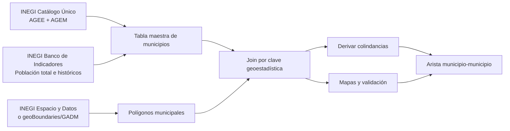

# Informe analítico sobre fuentes y datasets para municipios de México, población, colindancias y geografía

## Resumen ejecutivo

La combinación más sólida para este proyecto es usar **INEGI como fuente maestra de claves y nombres**, **INEGI Banco de Indicadores o México en Cifras para población municipal**, y **polígonos municipales para derivar colindancias por método espacial**. En particular, el **Catálogo Único de Claves de Áreas Geoestadísticas Estatales, Municipales y Localidades** es el mejor punto de partida para construir una llave maestra `AGEE + AGEM` y para rastrear cambios mediante **registro de actualización** y **tabla de equivalencia**. citeturn18view0turn19view0

Para población municipal, la opción más operativa y mejor documentada es el **Banco de Indicadores de INEGI**: su API permite consulta por **nación, entidad y municipio**, requiere **token**, y ofrece formatos **JSON, JSONP, XML** y también una variante **JSON-stat**; además, la interfaz del Banco de Indicadores exporta **XLS, IQY, CSV y TSV**. La guía documenta explícitamente el indicador **1002000001 como “Población total”**. citeturn14view0turn42view0turn46view1

Para visualización geográfica oficial, la mejor base consultada fue **Espacio y Datos de México** de INEGI, que expone la capa **Marco Geoestadístico**, funciones de **descarga**, **mapas para imprimir**, **Mapoteca** y consulta de indicadores territoriales, incluidos indicadores de **población y vivienda**. Para descarga masiva, INEGI ofrece un módulo aparte que baja un **ZIP** con un ejecutable y archivos auxiliares; es útil, pero operativamente menos cómodo en entornos no Windows. citeturn47view0turn46view0

No encontré, en las fuentes oficiales consultadas y parseables, un **archivo nacional oficial de colindancias municipio–municipio ya listo para descargar**. La vía más robusta es **derivarlas a partir de polígonos municipales** con una regla explícita de contigüidad. Como respaldo programático y abierto para geometrías, **geoBoundaries** ofrece una API con **GeoJSON, TopoJSON, ZIP y PNG**, bajo **CC BY 4.0**; sin embargo, para México su capa ADM2 consultada representa **2012**, por lo que no debe mezclarse sin reconciliación previa con catálogos municipales más recientes. **GADM** también sirve como respaldo, pero su licencia restringe redistribución y uso comercial. citeturn37view0turn39view0turn34view1turn40view0turn35view0

## Panorama de fuentes prioritarias

### INEGI Catálogo Único de claves

El **Catálogo Único de Claves de Áreas Geoestadísticas Estatales, Municipales y Localidades** es el registro nacional para **claves y nombres** de entidades, municipios y localidades. La ayuda oficial lo describe como un esquema de **actualización permanente**, orientado a asegurar identidad única e interoperabilidad entre registros administrativos y geográficos. También documenta tres modos especialmente valiosos para el proyecto: **catálogo vigente**, **registro de actualización** y **tabla de equivalencia** entre cortes temporales. citeturn19view0

Operativamente, esta fuente es la mejor para responder **“lista de municipios por estado”**, porque permite trabajar al nivel **AGEE** y **AGEM**, descargar en **DBF**, y usar **catálogos predefinidos en ZIP**. También es la fuente idónea para construir la llave de unión que luego se ocupará con población y con polígonos. La limitación es que en la vista consultada **no aparece una licencia puntual por dataset** ni una fecha global única de actualización del catálogo; lo que sí aparece es que el sistema trabaja con **fecha de corte** seleccionable. citeturn18view0turn19view0

### INEGI Banco de Indicadores y México en Cifras

**México en Cifras** permite consultar **indicadores sociodemográficos y económicos** por **nacional, entidad, municipio o localidad**, además de **tabulados, mapas, publicaciones y servicios**. Desde ahí se enlaza al **Banco de Indicadores** y a **Descarga masiva**, lo que lo convierte en una buena puerta de entrada para el componente estadístico del proyecto. citeturn45view0turn46view2

El **Banco de Indicadores** añade dos ventajas importantes. La primera es su cobertura municipal con **serie histórica**; la segunda, sus formatos de exportación en la interfaz: **XLS, IQY, CSV y TSV**. Por API, la documentación oficial indica que la consulta municipal depende del indicador, usa un **token** y recibe parámetros para **indicador**, **idioma**, **área geográfica**, **dato más reciente o serie histórica**, **fuente**, **versión** y **formato**. La guía muestra además el indicador **1002000001** como **Población total**. citeturn46view1turn14view0turn42view0

La principal limitación práctica es que, aunque la plataforma es muy potente, **no todos los flujos son igual de cómodos para automatizar**. Por ejemplo, **Descarga masiva** baja un **ZIP** que contiene `DescargaMasivaApp.exe`, `DescargaMasivaOD.xml` y `Leeme.txt`, es decir, un flujo muy orientado a escritorio Windows. Aun así, para lotes grandes puede ser útil si se trabaja en ese ecosistema. citeturn46view0

### INEGI Espacio y Datos de México

**Espacio y Datos de México** es la mejor fuente oficial consultada para **visualización y exploración espacial**. La interfaz expone la capa **Marco Geoestadístico**, escalas desde **1:1 000 000** hasta **1:10 000**, funciones de **descarga**, **vista previa**, **mapas para imprimir**, **Mapoteca** y generación de capas con posibilidad de recibir el producto por correo. Además, muestra indicadores de **población y vivienda** y otros temas territoriales. citeturn47view0

Para el proyecto, su papel ideal es doble. Primero, **validar visualmente** que la geometría/zonificación usada sea razonable antes de correr algoritmos. Segundo, **generar mapas de revisión** para comparar resultados con un contexto geográfico oficial. Su limitación es que la vista parseada no expone de forma clara, en este entorno, un **endpoint simple de descarga vectorial municipal tipo GeoJSON/Shapefile**, por lo que sigue siendo mejor complementarla con una fuente programática cuando el flujo de trabajo sea reproducible por código. citeturn47view0

### INE cartografía electoral

El INE mantiene el portal **cartografia.ine.mx/sige8**, que funciona como punto de entrada a su cartografía electoral. Es una fuente complementaria importante cuando el objetivo es contrastar municipios con **distritos, secciones y geografía electoral**. citeturn23view0turn23view1

En lo que pude verificar aquí, el portal es claramente útil como **referencia de validación electoral**, pero la página consultada no expuso en forma parseable una tabla de formatos de descarga, una licencia puntual, ni una fecha de actualización visible. Por eso, para un pipeline reproducible yo lo trataría como **visor oficial de contraste**, no como la primera opción para ingestión masiva automatizada, salvo que en una revisión manual posterior se identifique el dataset específico. citeturn23view0turn23view1

### Fuentes abiertas de respaldo

**geoBoundaries** es la mejor alternativa abierta y programática entre las fuentes no oficiales consultadas. Su sitio documenta una API establecida sobre HTTP para recuperar metadatos y enlaces de descarga; para México a nivel **ADM2** devuelve campos como **año representado**, **licencia**, **fuente**, **fecha de integración**, **build date** y enlaces directos a **ZIP, GeoJSON, TopoJSON y PNG preview**. Además, la licencia de la colección `gbOpen` es **CC BY 4.0**. citeturn36view0turn37view0turn39view0

La gran advertencia con geoBoundaries, para este caso, es que el endpoint `MEX/ADM2` consultado devuelve **boundaryYearRepresented = 2012** y `admUnitCount = 2457`. Eso lo vuelve excelente para prototipos, visualización rápida y repos reproducibles, pero **riesgoso como fuente maestra contemporánea** si no se reconcilia contra el catálogo oficial vigente de INEGI. citeturn39view0

**GADM** sigue siendo una reserva útil en investigación. Su página documenta la **versión 4.1**, descarga por país y licencia **académica/no comercial**, con restricción a **redistribución** y a **uso comercial sin permiso**. Lo usaría sólo como respaldo o para comparación metodológica, no como base final del proyecto si se espera liberar resultados de manera abierta. citeturn34view1turn40view0turn35view0

## Comparativo de fuentes

| Fuente | Tipo de datos | Formato disponible | Actualización observable | Cobertura geográfica | Licencia y uso | Utilidad para el proyecto |
|---|---|---|---|---|---|---|
| **INEGI Catálogo Único** citeturn18view0turn19view0 | Claves y nombres de AGEE, AGEM y localidades; equivalencias; historial de actualización | **DBF** en descarga directa y **ZIP** en catálogos predefinidos | **No especificada** como fecha global; el sistema usa **fecha de corte** | Nacional, entidad, municipio, localidad | **No especificada** en la vista consultada | **Fuente maestra** para lista de municipios por estado y llaves de unión |
| **INEGI Archivo Histórico de Localidades** citeturn18view1 | Historial de localidades y cambios | Consulta web | Versión observada de la aplicación: **202604241214** | Nacional por filtro geográfico | **No especificada** | Útil para rastrear cambios históricos de localidades y depurar series |
| **INEGI México en Cifras** citeturn45view0turn46view2 | Indicadores, tabulados, mapas, publicaciones y servicios | Consulta web; conexión a descarga masiva | **No especificada** | Nacional, entidad, municipio, localidad | **No especificada** | Buen hub oficial para localizar insumos y validar coberturas |
| **INEGI Banco de Indicadores** citeturn46view1turn14view0turn42view0 | Indicadores sociodemográficos y económicos con serie histórica | **XLS, IQY, CSV, TSV** en interfaz; **JSON, JSONP, XML, JSON-stat** por API | Depende del indicador; la API expone `LASTUPDATE` | Nacional, entidad y municipio | **No especificada** en la vista consultada; uso sujeto a token en API | Mejor opción para **población municipal** y otras variables |
| **INEGI Descarga masiva** citeturn46view0 | Descarga por programas, temas, periodos y formatos | **ZIP** con `exe + xml + txt` | **No especificada** | Nacional filtrable por programa/tema | **No especificada** | Útil para lotes grandes, menos cómodo para automatización multiplataforma |
| **INEGI Espacio y Datos de México** citeturn47view0 | Marco Geoestadístico, capas, mapas, indicadores territoriales | Descarga desde visor; **PDF** para impresión; formato vectorial **no especificado** en la vista parseada | `Edición` y `Fecha de actualización` por capa/indicador visibles en interfaz, pero **no legibles aquí** de forma consistente | Nacional con detalle espacial | **No especificada** | Mejor visor oficial para revisar geometrías y producir mapas de validación |
| **INE cartografía electoral** citeturn23view0turn23view1 | Cartografía electoral | Visor web; descarga **no especificada** en la vista consultada | **No especificada** | Nacional electoral | **No especificada** | Complemento para validar contra distritos y secciones |
| **geoBoundaries** citeturn36view0turn37view0turn39view0 | Límites administrativos abiertos | **ZIP, GeoJSON, TopoJSON, PNG preview, API** | Para MEX ADM2: `sourceDataUpdateDate = 2023-01-19`, `buildDate = 2023-12-12`, `boundaryYearRepresented = 2012` | Mundial; país/ADM | **CC BY 4.0** con atribución | La mejor alternativa abierta y programática; requiere reconciliación temporal |
| **GADM** citeturn34view1turn40view0turn35view0 | Límites administrativos | Descarga por país; formatos geoespaciales del proyecto GADM | Página consultada con **versión 4.1** | Mundial | Libre para uso **académico/no comercial**; restricción a redistribución/uso comercial | Respaldo útil, pero no ideal para un entregable abierto |

La lectura comparativa es clara: para un flujo reproducible y defendible, yo **no mezclaría indiscriminadamente** fuentes oficiales y abiertas. La arquitectura más limpia es **Catálogo Único + Banco de Indicadores + una geometría municipal reconciliada**, usando **Espacio y Datos** para validar visualmente y **geoBoundaries/GADM** sólo como soporte o fallback técnico. citeturn19view0turn46view1turn47view0turn39view0turn35view0

### Recomendación por insumo

| Insumo que necesitas | Fuente recomendada | Motivo |
|---|---|---|
| Lista de municipios por estado | **INEGI Catálogo Único** citeturn18view0turn19view0 | Claves oficiales, nombres, equivalencias y actualización permanente |
| Población municipal | **INEGI Banco de Indicadores / México en Cifras** citeturn46view1turn45view0turn42view0 | Cobertura municipal, serie histórica y exportación estándar |
| Colindancias municipio–municipio | **Derivadas desde polígonos** | No apareció un dataset oficial nacional listo para descargar en las fuentes consultadas; es más seguro derivarlas |
| Visualización y revisión geográfica | **INEGI Espacio y Datos** citeturn47view0 | Marco Geoestadístico, capas y mapas para imprimir |
| Validación electoral | **INE cartografia.ine.mx** citeturn23view0turn23view1 | Contraste con geografía electoral |
| Fallback programático abierto | **geoBoundaries** citeturn37view0turn39view0 | API limpia y formatos abiertos |

## Recomendación operativa y flujo de datos

Si el objetivo es construir una base robusta para un proyecto de integridad municipal y redistritación, mi recomendación es esta: usar **Catálogo Único** como padrón de referencia, poblarlo con **Población total** desde el **Banco de Indicadores**, anexar una capa municipal para visualización y derivar **colindancias** desde esa capa. Ese orden minimiza problemas de claves, evita depender de nombres de municipios y desacopla la parte estadística de la parte geométrica. citeturn19view0turn42view0turn47view0



La decisión metodológica clave está en la colindancia. Para este tipo de proyecto, conviene **definir explícitamente la regla de contigüidad**: si basta contacto en vértice, una regla tipo **queen**; si se exige frontera compartida real, una regla tipo **rook**. En proyectos de distritación municipal, suele ser más prudente documentar esa decisión desde el inicio y mantenerla constante en todo el pipeline. Esa regla no viene resuelta en las fuentes consultadas; hay que construirla. citeturn47view0turn39view0

## Instrucciones breves para descargar y usar

Estas son las **URLs directas verificadas** y más útiles para arrancar el trabajo. Los enlaces se listan como texto plano para que puedas copiarlos fácilmente. citeturn18view0turn18view1turn45view0turn46view0turn47view0turn14view0turn23view0turn36view0turn37view0turn34view1

```text
INEGI Catálogo Único
https://www.inegi.org.mx/app/ageeml/

Ayuda general del Catálogo Único
https://www.inegi.org.mx/contenidos/app/ageeml/Ayuda/Ayuda_Gral_Cat_Unico.pdf

INEGI Archivo Histórico de Localidades
https://www.inegi.org.mx/app/geo2/ahl/

INEGI México en Cifras
https://www.inegi.org.mx/app/areasgeograficas/

INEGI Descarga masiva
https://www.inegi.org.mx/app/descarga/

INEGI Banco de Indicadores
https://www.inegi.org.mx/app/indicadores/

INEGI API del Banco de Indicadores
https://www.inegi.org.mx/servicios/api_indicadores.html

INEGI Espacio y Datos de México
https://www.inegi.org.mx/app/mapa/espacioydatos/

INE cartografía electoral
https://cartografia.ine.mx/sige8/

geoBoundaries
https://www.geoboundaries.org/

geoBoundaries API MEX ADM2
https://www.geoboundaries.org/api/current/gbOpen/MEX/ADM2/

GADM
https://gadm.org/download_country.html
```

### Cómo usar cada fuente

Para **lista de municipios por estado**, entra al **Catálogo Único**, selecciona `Área Geoestadística Estatal (AGEE)` o `Área Geoestadística Municipal (AGEM)`, usa el tipo de reporte **Catálogo** para el corte vigente, y descarga el resultado en **DBF** o usa los **catálogos predefinidos ZIP**. Si necesitas rastrear cambios de nombres o creaciones/supresiones, usa **Registro de actualización** y **Tabla de equivalencia**. citeturn18view0turn19view0

Para **población municipal**, hay dos caminos. El visual: **México en Cifras / Banco de Indicadores**, filtrando por municipio y exportando **CSV/TSV/XLS**. El programático: la **API del Banco de Indicadores**, con token y el indicador apropiado. La guía muestra la sintaxis y documenta **1002000001 = Población total**. citeturn46view1turn14view0turn42view0

```text
Plantilla general de la API de INEGI
https://www.inegi.org.mx/app/api/indicadores/desarrolladores/jsonxml/INDICATOR/<ID_INDICADOR>/es/<CLAVE_GEO>/false/BISE/2.0/<TU_TOKEN>?type=json

Ejemplo documentado en la guía
https://www.inegi.org.mx/app/api/indicadores/desarrolladores/jsonxml/INDICATOR/1002000001/es/00/false/BISE/2.0/<TU_TOKEN>?type=json
```

Para **visualización geográfica oficial**, usa **Espacio y Datos de México** y activa la capa **Marco Geoestadístico**. Ahí puedes revisar mapas, escalas, capas, vista previa y mapas para imprimir. Si tu objetivo es bajar muchos archivos, **Descarga masiva** puede ayudar, aunque su flujo práctico depende de descargar un **ZIP** que contiene un ejecutable. citeturn47view0turn46view0

Para una **alternativa programática abierta**, usa **geoBoundaries API**. El endpoint documentado es el siguiente, donde `RELEASE-TYPE` puede ser `gbOpen`, `gbHumanitarian` o `gbAuthoritative`, y `ADM2` corresponde al nivel municipal. La propia API devuelve los enlaces finales de descarga. citeturn37view0turn39view0

```text
Patrón del endpoint geoBoundaries
https://www.geoboundaries.org/api/current/[RELEASE-TYPE]/[3-LETTER-ISO-CODE]/[BOUNDARY-TYPE]/

Ejemplo para México municipal
https://www.geoboundaries.org/api/current/gbOpen/MEX/ADM2/
```

En geoBoundaries no se documentó, en la página consultada, un **límite de tasa** explícito; sí se advierte que **no se garantiza uptime**, y que la **atribución es obligatoria**. En la API para México, el propio JSON devuelve `staticDownloadLink`, `gjDownloadURL`, `tjDownloadURL` e `imagePreview`, lo que facilita mucho flujos reproducibles. citeturn37view0turn39view0

## Ejemplos de carga en Python y QGIS

### Python con `pandas` y `geopandas`

El ejemplo más limpio para un prototipo es: obtener **claves** desde INEGI, usar la **API de Indicadores** para población, y cargar **polígonos** desde geoBoundaries u otra fuente municipal reconciliada. El siguiente bloque muestra la estructura básica. La selección de la fuente de polígonos y la llave exacta (`CVEGEO`, `shapeID`, etc.) debe ajustarse al archivo que uses. Las capacidades de formato y endpoint están documentadas en las fuentes citadas. citeturn46view1turn42view0turn39view0

```python
import requests
import pandas as pd
import geopandas as gpd

# 1) Polígonos municipales abiertos de respaldo
meta = requests.get(
    "https://www.geoboundaries.org/api/current/gbOpen/MEX/ADM2/"
).json()

mun = gpd.read_file(meta["gjDownloadURL"])

# Revisa columnas disponibles; en geoBoundaries suelen variar por release
print(mun.columns.tolist())

# 2) Población desde INEGI API
# Sustituye TU_TOKEN y la clave geográfica que corresponda.
url = (
    "https://www.inegi.org.mx/app/api/indicadores/desarrolladores/jsonxml/"
    "INDICATOR/1002000001/es/00/false/BISE/2.0/TU_TOKEN?type=json"
)
resp = requests.get(url, timeout=30)
data = resp.json()

# Ejemplo mínimo para inspeccionar la serie
obs = pd.DataFrame(data["Series"][0]["OBSERVATIONS"])
print(obs.head())
```

Si ya tienes un **CSV municipal** con claves INEGI y población, la unión espacial/estadística suele verse así. citeturn19view0turn46view1

```python
import pandas as pd
import geopandas as gpd
import matplotlib.pyplot as plt

mun = gpd.read_file("municipios.geojson")
pop = pd.read_csv("poblacion_municipal.csv", dtype={"CVEGEO": str})

gdf = mun.merge(pop, on="CVEGEO", how="left")

ax = gdf.plot(column="POB_TOT", legend=True, figsize=(10, 8))
ax.set_title("Población municipal")
ax.set_axis_off()
plt.tight_layout()
plt.show()
```

### Derivar colindancias en Python

Si no encuentras un dataset listo de colindancias, este flujo produce una **lista de aristas municipio–municipio** a partir de polígonos. Conviene antes validar geometrías y decidir si usarás `touches` o una contigüidad más estricta. citeturn47view0turn39view0

```python
import geopandas as gpd
import pandas as pd

mun = gpd.read_file("municipios.geojson")[["CVEGEO", "NOM_MUN", "geometry"]].copy()

# Corregir geometrías inválidas si hace falta
mun["geometry"] = mun.buffer(0)

# Self-join espacial por contacto topológico
adj = gpd.sjoin(
    mun[["CVEGEO", "geometry"]],
    mun[["CVEGEO", "geometry"]],
    how="inner",
    predicate="touches"
)

adj = adj.rename(columns={"CVEGEO_left": "mun_a", "CVEGEO_right": "mun_b"})
adj = adj.loc[adj["mun_a"] != adj["mun_b"], ["mun_a", "mun_b"]].drop_duplicates()

# Normalizar pares no dirigidos
adj["pair"] = adj.apply(lambda r: tuple(sorted((r["mun_a"], r["mun_b"]))), axis=1)
adj = adj.drop_duplicates("pair")
adj[["mun_a", "mun_b"]] = pd.DataFrame(adj["pair"].tolist(), index=adj.index)
adj = adj.drop(columns="pair").sort_values(["mun_a", "mun_b"])

adj.to_csv("colindancias_municipales.csv", index=False)
print(adj.head())
```

### Carga rápida en QGIS

En **QGIS**, la ruta corta es cargar tu capa municipal vectorial, luego unir el CSV de población por clave geoestadística, y finalmente simbolizar por coropletas. Para la parte estadística, basta con **Capa vectorial → Propiedades → Uniones** y unir por `CVEGEO` o la llave equivalente del shapefile/GeoJSON. Para revisiones cartográficas, **Espacio y Datos de México** puede seguir usándose como referencia paralela. citeturn47view0turn19view0

Para explorar colindancias en QGIS, puedes usar una **consulta espacial** basada en el predicado **touches** o construir un pequeño flujo en **PyQGIS**. Si el entregable exige una regla de contigüidad estricta, documenta si aceptas contacto por vértice o sólo frontera compartida. Esa decisión importa más que la herramienta. citeturn47view0turn39view0

## Vacíos, limitaciones y cómo resolverlos

La principal laguna, para fines de modelación, es la **ausencia de un archivo oficial nacional claramente documentado y listo para descargar de colindancias municipio–municipio** en las páginas oficiales que sí pude verificar aquí. Por eso, el camino más seguro es **derivar la matriz o lista de vecinos** desde polígonos municipales. Ese enfoque además te deja decidir la definición de vecindad que usarás en el modelo. citeturn47view0turn23view0turn23view1

La segunda limitación es la **fricción entre catálogos oficiales vigentes y geometrías abiertas alternativas**. El ejemplo más claro es geoBoundaries: para México municipal, el propio endpoint reporta **2012** como año representado. Eso no invalida la fuente, pero sí obliga a una **reconciliación por clave y fecha** antes de usarla en un proyecto de redistritación contemporáneo. citeturn39view0

La tercera es de **licenciamiento**. En las páginas oficiales de INEGI e INE consultadas aquí **no apareció una licencia puntual por dataset** en forma visible y parseable, mientras que en fuentes abiertas sí: **geoBoundaries = CC BY 4.0** y **GADM = académico/no comercial**. Si el proyecto terminará en un repositorio público, artículo o software distribuible, conviene dejar esto resuelto desde el inicio. citeturn36view0turn37view0turn35view0

Mi recomendación final, por equilibrio entre trazabilidad, operatividad y apertura, es la siguiente: **Catálogo Único de INEGI** para municipios; **Banco de Indicadores / México en Cifras** para población; **Espacio y Datos de México** para validación cartográfica oficial; **colindancias derivadas** desde polígonos; y **geoBoundaries** sólo como geometría programática rápida si antes haces control de calidad temporal y de claves. Ese stack minimiza sorpresas metodológicas y hace más defendible el proyecto ante una revisión académica o técnica. citeturn19view0turn46view1turn47view0turn39view0